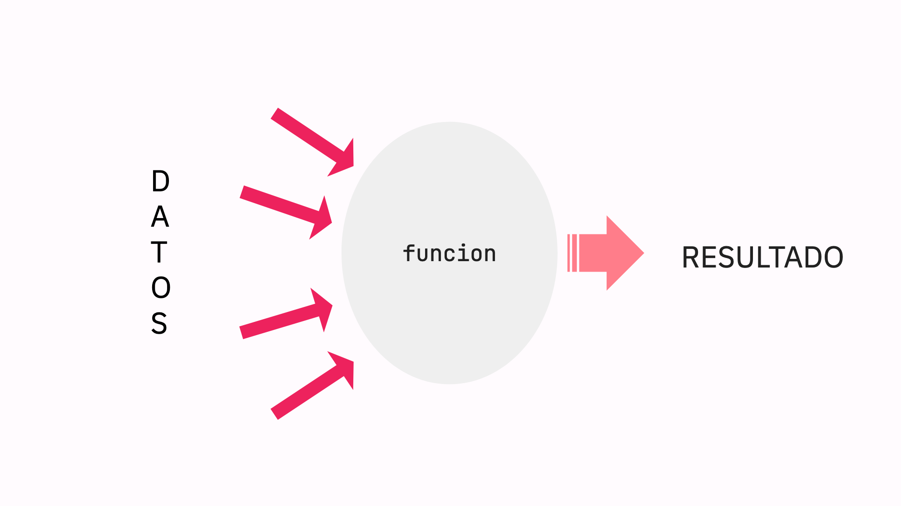

# Funciones
Las funciones son estructuras de código que permiten **modularizar** nuestro código. Es decir, se subdivide un problema en varios subproblemas, y cada subproblema se encararía mediante una función.



Las funciones pueden pensarse de forma coloquial como un "coso" que recibe información, la computa, y retorna un sólo resultado. 

En nuestro caso, vamos a usar las funciones de dos formas:

1. **Predefinidas** 

Vamos a aprovechar funciones que ya existen para mejorar nuestros dibujos y animaciones. Por ejemplo, existen funciones que nos dan un número al azar entre un rango, podemos usar eso para dibujar dados, cartas de uno, simulaciones y animaciones que necesiten azar, etc.

2. **Creadas por nosotros**

Vamos a escribir funciones para agregar nuevas instrucciones de dibujo. Por ejemplo, podríamos querer que al escribir ```luna()``` dibuje una luna en la pantalla. La función ```luna()``` no existe en p5js, pero la podemos agregar nosotros escribiendo una función.

## Utilidad
La utilidad de las funciones se ve resumida en tres características:
1. **Encapsular funcionamiento:**

Todas las instrucciones de un programa que pertenezcan lógicamente a un solo trabajo o a un solo subproblema, pueden encapsularse mediante una función.

Por ejemplo: si tengo muchas instrucciones que dibujan un autito, es posible encapsular todas esas instrucciones en una función propia.

2. **Evitar la repetición de código:**

Si en más de una ocasión en nuestro programa tenemos que repetir el mismo set de instrucciones, podemos evitar la repetición haciendo una función con nuestro set de instrucciones e invocar dicha función más de una vez.

3. **Reusar y compartir código:**

Una vez que tenemos una función en un programa podemos reutilizarla en otro sin necesidad de volver a escribirla. De la misma manera podemos compartirlas con otros programadores. Si hicimos una función ```luna```, la podemos copiar y pegar y usar en múltiples dibujos.

