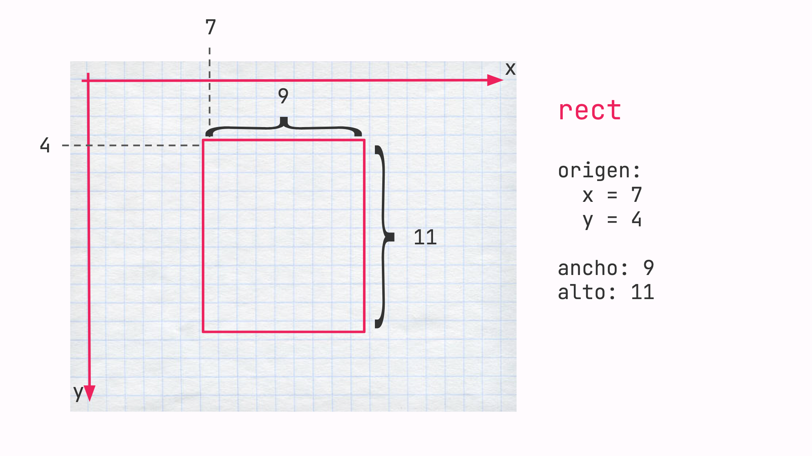

# Proyecto Emoji
En este proyecto vamos a empezar a conocer el entorno de p5js programando una carita simple. Para esto vamos a usar las instrucciones para dibujar rectángulos y elipses.
### Contenidos y Aprendizajes
Sintaxis javascript y p5, estructura general de algoritmo de processing, instrucciones primitivas de dibujos de rectángulos, elipses (ellipse, rect).

| Etapas | Actividades |
| :---- | :---- |
| Etapa 1 | Introducción al entorno de p5js, primeras instrucciones de dibujo. |
| Etapa 2 | Uso de la instrucción rect y ellipse para dibujar una carita sencilla. |


## Etapa 1: Intrucciones de dibujo
Las instrucciones de p5 nos van a permitir dibujar cosas en el lienzo, cada instrucción indica qué dibujar y algunos parámetros describen cómo se dibuja. Los parámetros son información que agregamos a una instrucción para indicar, por ejemplo, tamaño, posición, color, etc.

### rect
Para dibujar un rectángulo, necesitamos especificar cuatro parámetros. Los primeros dos indican las coordenadas X e Y de la esquina superior izquierda de un rectángulo. Luego necesitamos indicar el ancho y por último el alto. Es decir:
```
origen:
    x=7
    y=4
ancho: 9
alto: 11
```



En este caso rect es la **instrucción** para dibujar un rectángulo y los números dentro del paréntesis son sus **parámetros** en el orden definido anteriormente.
```js
rect (7,4,9,11)
```
La instrucción ellipse, funciona de la misma manera, indicando cuatro parámetros que simbolizan posición y tamaño, sólo que dibuja óvalos o círculos

## Etapa 2: Creación de un emoji
<!-- TODO redactar acorde al proyecto -->
# Sintaxis
Según lo que estuvimos viendo anteriormente, tenemos las siguientes instrucciones:
```js
createCanvas(400,400)
```
```js
rect(70,40,90,110)
```
Ahora necesitamos organizarlo en un código funcional. Para esto tenemos que entender el concepto de bloques. Los bloques de programación son las instrucciones que están entre los símbolos ```{ }```

Los programas p5 generalmente cuentan con dos bloques.
```Setup``` sirve como nuestro bloque de inicialización de variables, tamaño de lienzo, y a veces configuración del color de fondo. Las instrucciones de un bloque ```setup``` se realizan sólo una vez.
El bloque ```draw``` es donde vamos a escribir todas nuestras instrucciones de dibujo. ```Draw``` es un ciclo infinito. Al terminar todas las instrucciones del bloque se vuelven a ejecutar desde el principio.
```js
function setup(){
    createCanvas(400, 400)
}
function draw(){
    rect(70, 40, 90, 110)
}
```
_Código en p5 con el canvas de 400 píxeles de ancho por 400 de alto. Y un rectángulo en la posición (70,40) de 90 píxeles de ancho y 110 de alto._
