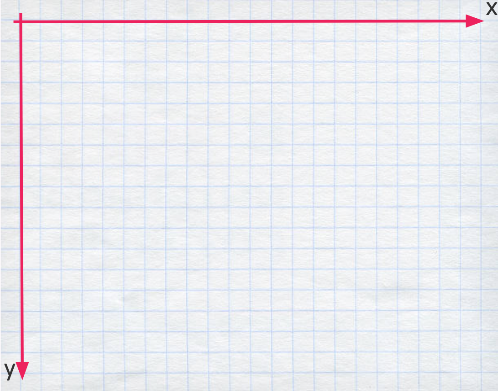

# P5js Y Algorítmica
Hacer un resumen del entorno p5 basado en lo redactado en la intro
## Lienzo

Para dibujar es necesario especificar un lienzo de dibujo. En p5 un lienzo es un conjunto de píxeles organizados en forma de cuadrícula. Como ejemplo podríamos pensarlo como una hoja cuadriculada como la que sigue:




### Crear Lienzo
Si especificamos los detalles de nuestro lienzo ejemplo, podríamos definir su tamaño según los ejes X e Y:

```
tamaño x = 22
tamaño y = 17
```
Esto en el lenguaje de programación se escribe de la siguiente manera:
```js
 createCanvas(22,17)
```
