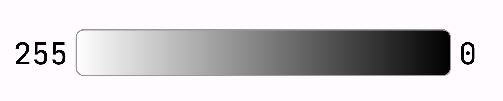
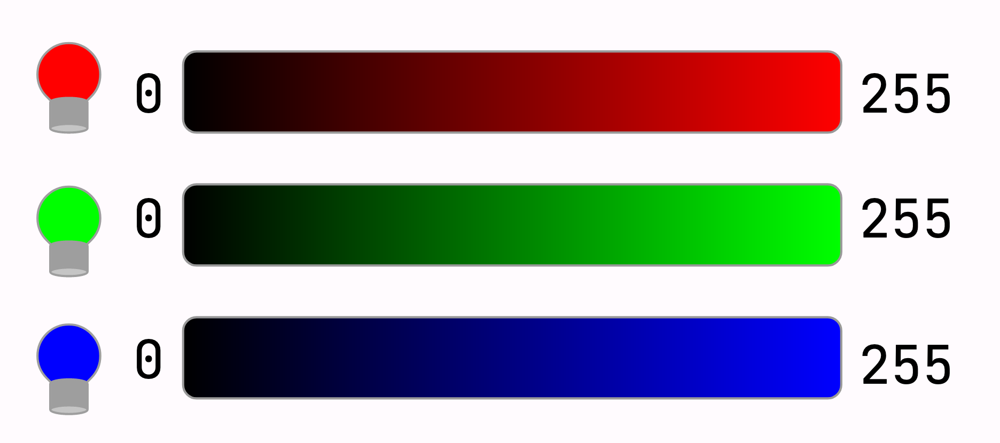
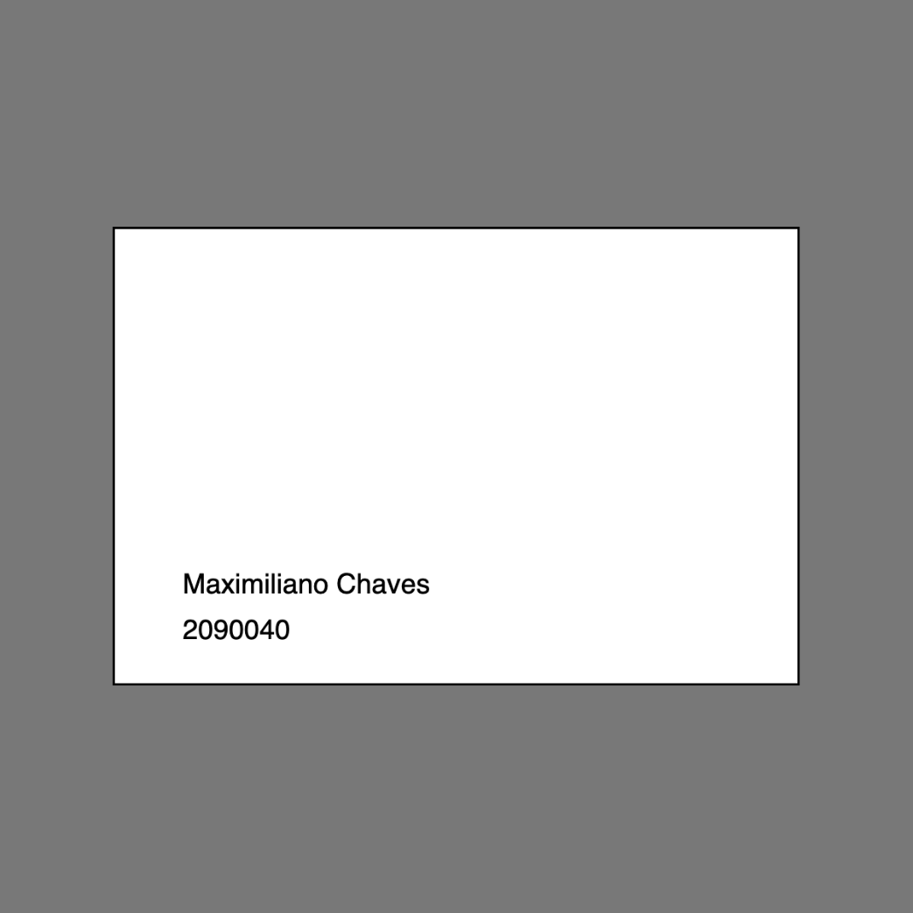

# Tarjeta de Identificación

### Contenidos y Aprendizajes
Instrucciones primitivas para el manejo de colores y para escribir texto en el canvas

| Etapas | Actividades | 
| :---- | :---- | 
| Etapa 1 | Presentación sobre colores RGB y las instrucciones de pintado. Explicación del uso de text para dibujar texto en el canva | Instrucciones primitivas para el manejo de colores y para escribir texto en el canvas |
| Etapa 2 | Dibujar una tarjeta de crédito o tarjeta de identificación, decorada y pintada de forma libre. |  


# Etapa 1: Colores
Los dibujos que hicimos hasta ahora son monocromáticos. P5 nos provee de instrucciones para poder pintar tanto el fondo del lienzo como cada forma que programemos.

P5 tiene una gama de 256 colores para tanto la escala de grises como para cada color primario. Los colores primarios que se usan son el rojo, el verde y el azul (RGB), los colores primarios de la luz.

Las funciones para pintar en processing son:
```js
background
```
Que nos permite pintar el fondo del dibujo, es decir que colorea el lienzo
```js
fill
```
Que sirve para pintar todas las figuras que dibujemos después de esta instrucción
```js
stroke
```
Pinta el contorno de las figuras.

## De qué color?

Todas estas instrucciones reciben 1 o 3 parámetros. Si la usamos con un sólo parámetro, se asume que se esta coloreando en escala de grises.



```js
background(120)
```
> _Pintaría el fondo de un color gris oscuro_

Cuando usamos 3 parámetros, se pinta en colores usando el primer número como el valor de rojo, el segundo como el valor de verde y el último como el valor de azul.



```js
fill(240,240,60)
```
> _Pintaría las figuras de un color similar a un amarillo._

Combinando los tres valores, podemos generar 65 millones de variaciones de colores diferentes.
<!-- TODO: buscar si puedo hacer una tabla con colores hex -->

## Etapa 2: Diseñando una Tarjeta de Identificación

La idea es hacer un dibujo de una Tarjeta de Identificación usando las instrucciones aprendidas hasta ahora. La idea básica es tener un rectángulo que simule ser la tarjeta, algunas figuras a modo de decoración y, con una nueva instrucción, escribir el nombre del dueño de la tarjeta y algún número de identificación.

Partamos de un esqueleto en p5js básico.

```js
function setup(){
    createCanvas(400,400)
}

function draw(){
    background(120)
}
```

Primero que nada, realicemos un rectángulo que sea la base de nuestra tarjeta. Por ejemplo:
```js
  rect(50,100,300,200)
```

Sobre este rectángulo vamos a realizar todas nuestras decoraciones. Empecemos por lo nuevo, la instrucción ```text```. 
### ```text```
La instrucción text permite escribir en nuestro canvas. Text lleva tres parámetros, el primero es lo que vamos a escribir, y los últimos dos son las posiciones x e y en el canvas. Si lo que vamos a escribir es un texto, el primer parámetro debe escribirse entre comillas, si vamos a escribir un número se pone directamente el número.

Escribamos nuestro nombre en la tarjeta usando algo parecido a:
```js
    text("Maximiliano Chaves", 80,260)
```

Podemos tambien agregar un número de socio/identificación con la misma técnica. Pero podemos agregar la instrucción ```textSize(14)``` para cambiar el tamaño del texto a 14

```js
    textSize(14)
    text(2090040,80,280)
```

Con esto, llegamos a una primera base


```js
function setup() {
  createCanvas(400,400)
}

function draw() {
  background(120)
  rect(50,100,300,200)
  textSize(14)
  text("Maximiliano Chaves", 80,260)
  text(2090040,80,280)
}
```

A partir de ahora es cuestión de modificar libremente hasta quedarnos con algo que nos guste. Con las instrucciones que tenemos podemos hacer muchas cosas interesantes. En mi caso voy a pintar mi tarjeta de violeta. Voy a agregar dos circulitos a modo de decoración. Y voy a intentar dibujar un "chip" a un costado usando rectángulos. 

Mi función ```draw``` quedaría así:

```js
function draw() {
  background(120)
  
  stroke(180,80,240)
  fill(180,80,240)
  rect(50,100,300,200)
  
  fill(0)
  textSize(14)
  text("Maximiliano Chaves", 80,260)
  text(2090040,80,280)
  
  fill(230,40,40)
  ellipse(290,160,40,40)
  fill(40,230,230)
  ellipse(260,160,40,40)
  
  fill(220)
  stroke(50)
  rect(80,200,60,20)
  rect(80,220,60,20)
  rect(100,210,40,20)
}
```

