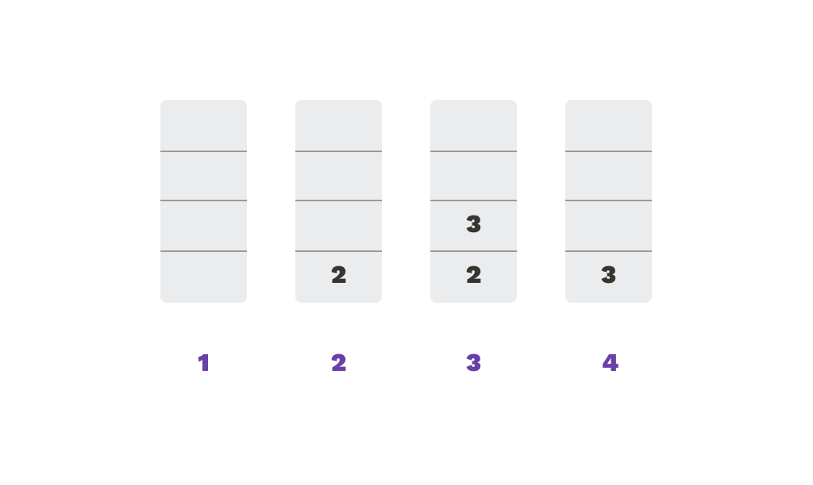

# Operaciones

* ```Encolar(x)```
Inserta al final de la secuencia el elemento ```x```
* ```Desencolar()```
Elimina de la secuencia el elemento en primer lugar
* ```Consultar() ```
Retorna el elemento que está en primer lugar para ser utilizado
* ```Vacía()```
Retorna verdadero si la cola está vacía, falso en caso contrario 
* ```Llena()```
Retorna verdadero si la cola está llena, falso en caso contrario.

### Ejemplo

```py
Q = cola(4) 
print(Q.vacia())
Q.encolar(2)
Q.encolar(3)
x = Q.consultar()
print(x)
Q.desencolar()
print(Q.llena())
```

Veamos paso a paso:
```py
Q = cola(4)
```
Primero creamos una variable ```Q``` de tipo cola, de tamaño 4. 
```py
print(Q.vacia()) 
```
Hacemos un ```print``` de la operación ```vacía```, que retorna verdadero porque la cola está recién creada y vacía.|
```py
Q.encolar(2)
Q.encolar(3) 
```
Luego encolamos el número 2 y después el número 3.
```py
x = Q.tope()
```
Guardamos en una variable ```x``` lo que retorna el tope. Es decir, ```x``` termina teniendo el numero 3.
```py
print(x)|
```
Se imprime ```x```
```py
Q.desapilar()
print(Q.llena())
```
Por último, se desapila el 3 y se imprime el resultado de la operación llena, que es falso


En el gráfico muestro paso a paso cómo fue cambiando la cola.
<!-- TODO:  insertar imagen acá al final o en el medio de cada paso arriba-->

