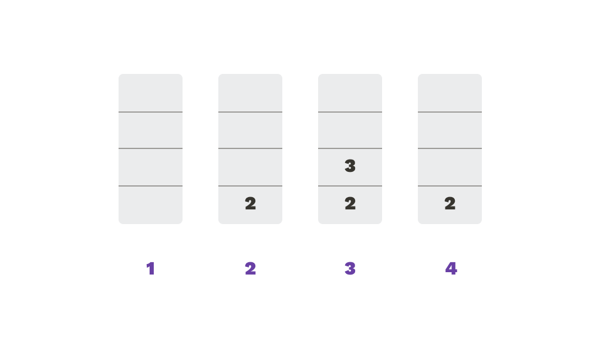

# Operaciones

* ```Apilar(x)```
Inserta al final de la secuencia el elemento ```x```
* ```Desapilar()```
Elimina de la secuencia el elemento en último lugar
* ```Tope() ```
Retorna el elemento que está en último lugar para ser utilizado
* ```Vacía()```
Retorna verdadero si la pila está vacía, falso en caso contrario 
* ```Llena()```
Retorna verdadero si la pila está llena, falso en caso contrario.

### Ejemplo

```py
S = pila(4) 
print(S.vacia())
S.apilar(2)
S.apilar(3)
x = S.tope()
print(x)
S.desapilar()
print(S.llena())
```

Veamos paso a paso:
```py
S = pila(4)
```
Primero creamos una variable ```S``` de tipo pila, de tamaño 4. 
```py
print(S.vacia()) 
```
Hacemos un ```print``` de la operación ```vacía```, que retorna verdadero porque la pila está recién creada y vacía.|
```py
S.apilar(2)
S.apilar(3) 
```
Luego apilamos el número 2 y después el número 3.
```py
x = S.tope()
```
Guardamos en una variable ```x``` lo que retorna el tope. Es decir, ```x``` termina teniendo el numero 3.
```py
print(x)|
```
Se imprime x
```py
S.desapilar()
print(S.llena())
```
Por último, se desapila el 3 y se imprime el resultado de la operación llena, que es falso

En el gráfico muestro paso a paso cómo fue cambiando la cola.
