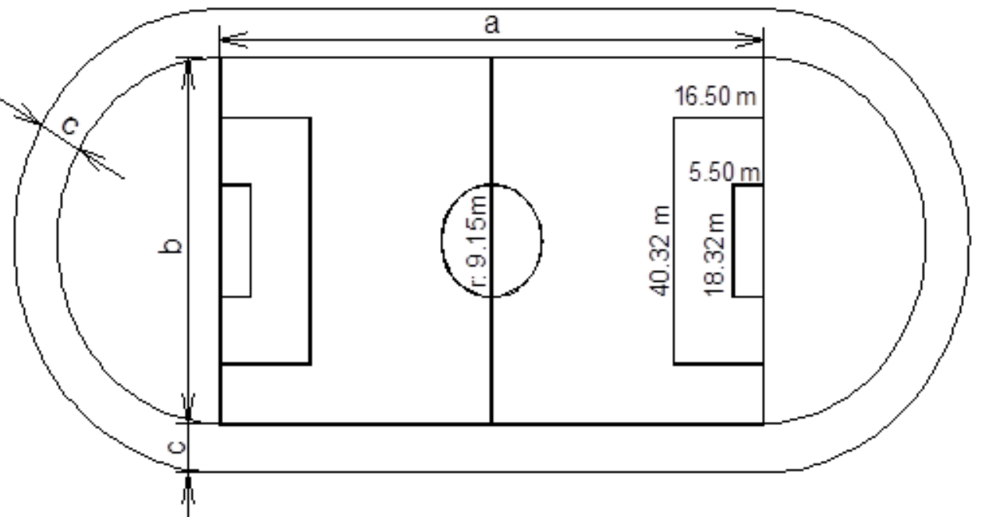

# Guia 1
Guía de ejercicios de estructura secuencial:
1. Un emprendedor carga en el sistema sus 3 mejores ventas, el 10% del total de estas ventas van dedicadas al ahorro para mejoras en la tienda. Hacer un algoritmo que reciba las ventas e indique cual es el monto a ahorrar.
2. Un artesano tiene que hacer pulseras de hilo. Cada pulsera necesita 4 metros de hilo. Teniendo la cantidad de hilo que va a comprar, indicar a cuantas pulseras puede hacer.
3. Considere un plano cartesiano que contiene un círculo y un punto. Determine si el punto está dentro o fuera del círculo.
<!-- hacer imagen -->
4. La cantidad de alimento que un gato debe comer se determina por la siguiente regla: 30gr por kilogramo de peso, repartida en dos porciones por día. Dado el peso del gato indicar la cantidad de alimento a comer por día, y cuanto alimento se debería comprar al mes (asumiendo meses de 31 días)
5. Un hospital ha recibido una donación de dinero. Su Director ha decidido repartir dicha donación entre algunas dependencias del hospital aplicando el siguiente criterio:
* Terapia intensiva: 80% de Neonatología
* Neonatología: 70% de Cardiología
* Cardiología: 30% de la donación
* Administración: lo que reste de la donación.
Se requiere determinar cuánto dinero recibirá cada dependencia.

6. Una empresa dedicada a la renovación de estadios de fútbol, requiere un algoritmo para calcular los puntos que se solicitan a continuación. Tener en cuenta que el estadio visto en planta, consta de una zona central de forma rectangular y dos cabeceras semicirculares.
a) Dadas las dimensiones de la parte rectangular, se requiere calcular el área de la superficie a cubrir con
césped sintético. Se cubrirá con piso sintético la cancha y las cabeceras.
b) Con los datos del croquis adjunto calcular el área de la superficie de la pista de atletismo que rodea al
piso sintético, esta zona será pavimentada y pintada.
c) Calcular la longitud total lineal de las líneas que demarcan el campo de juego, más las líneas que
demarcan las áreas que rodean a los arcos y además la línea que demarca el círculo central.
Nota hacer un único algoritmo que calcule todo lo pedido.

